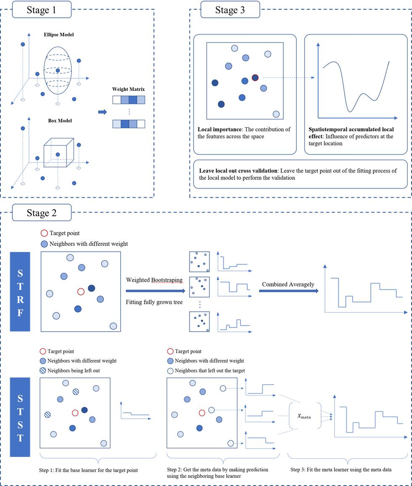

# GeoRegression
> A geospatial based framework for conducting non-linear regression.

<p align="center">
  
</p>

<p align="center">
  <a href="https://github.com/yqx-github/GeoRegression/blob/main/LICENSE"></a>
  <a href="https://pypi.org/project/georegression/"></a>
  <a href="https://www.python.org/downloads/release/python-370/"></a>
</p>

This Python package provides a framework for conducting regression model on the geospatial data by incorporating the spatial information of the data to solve the problem of spatial non-stationarity. The SpatioTemporal Random Forest (STRF) and SpatioTemporal Stacking Tree (STST) are built on top of this framework. 



# Installation

Python with version >= 3.7 is required.

```bash
pip install georegression
```

# Quick Start
- The full example can be found in the `Examples` folder.

## Data Preparation
- Use the provided function to generate the sample data with spatial non-stationarity.
```python
import numpy as np
from georegression.simulation.simulation_for_fitting import generate_sample, f_square, coef_strong

X, y, points = generate_sample(500, f_square, coef_strong, random_seed=1, plot=True)
X_plus = np.concatenate([X, points], axis=1)
```

## SpatioTemporal Random Forest (STRF)
- The `WeightModel` class provides the basic weighted framework for regression.
- In the weighted framework, each local models do not see the y value of the target location, therefore, the prediction of each local model is the prediction of the whole model.

```python
from sklearn.ensemble import RandomForestRegressor
from georegression.weight_model import WeightModel

distance_measure = "euclidean"
kernel_type = "bisquare"

grf_neighbour_count=0.3
grf_n_estimators=50
model = WeightModel(
    RandomForestRegressor(n_estimators=grf_n_estimators),
    distance_measure,
    kernel_type,
    neighbour_count=grf_neighbour_count,
)
model.fit(X_plus, y, [points])
print('STRF R2 Score: ', model.llocv_score_)

# --- Alternative ---

from sklearn.metrics import r2_score
y_predict = model.local_predict_
score = r2_score(y, y_predict)
print(score)

```

## SpatioTemporal Stacking Tree (STST)
- The `StackingWeightModel` class provides the weighted stacking framework for regression.
- In the weighted stacking framework, each local models do not see the y value of the target location, therefore, the prediction of each local model is the prediction of the whole model.

```python
from sklearn.tree import DecisionTreeRegressor
from sklearn.ensemble import ExtraTreesRegressor
from georegression.stacking_model import StackingWeightModel

distance_measure = "euclidean"
kernel_type = "bisquare"

stacking_neighbour_count=0.3
stacking_neighbour_leave_out_rate=0.1
model = StackingWeightModel(
    DecisionTreeRegressor(splitter="random", max_depth=X.shape[1]),
    # Or use the ExtraTreesRegressor for better predicting performance.
    # ExtraTreesRegressor(n_estimators=10, max_depth=X.shape[1]), 
    distance_measure,
    kernel_type,
    neighbour_count=stacking_neighbour_count,
    neighbour_leave_out_rate=stacking_neighbour_leave_out_rate,
)
model.fit(X_plus, y, [points])
print('STST R2 Score: ', model.llocv_stacking_)

# --- Alternative ---

from sklearn.metrics import r2_score
y_predict = model.stacking_predict_
score = r2_score(y, y_predict)
print(score)
```

## GWR / GTWR
```python
from sklearn.linear_model import LinearRegression
from georegression.weight_model import WeightModel

distance_measure = "euclidean"
kernel_type = "bisquare"

gwr_neighbour_count=0.2
model = WeightModel(
    LinearRegression(),
    distance_measure,
    kernel_type,
    neighbour_count=gwr_neighbour_count,
)
model.fit(X_plus, y, [points])

print('GWR R2 Score: ', model.llocv_score_)

# --- Alternative ---

from sklearn.metrics import r2_score
y_predict = model.local_predict_
score = r2_score(y, y_predict)
print(score)
```

## Prediction
- Although in the weighted framework, the prediction of each local model is the prediction of the whole model, two methods are provided for making prediction for the new data:
    - `predict_by_fit`: Fit new local model for prediction data using the training data to make prediction.
    - `predict_by_weight`: Predict using local estimators and weight the local predictions using the weight matrix that calculated by using training locations as source and prediction locations as target.

```python
X_test, y_test, points_test = generate_sample(500, f_square, coef_strong, random_seed=2, plot=False)
X_test_plus = np.concatenate([X_test, points_test], axis=1)

y_predict = model.predict_by_fit(X_plus, y, [points], X_test_plus, [points_test])

# For weight model:
# y_predict = model.predict_by_fit(X_test_plus, [points_test])

# For predict by weight:
# y_predict = model.predict_by_weight(X_test_plus, [points_test])
score = r2_score(y_test, y_predict)
print(score)
```

## SpatioTemporal
- To use more than one dimension of spatial information, just add the new dimension to the input data.

```python
times = np.random.randint(0, 10, size=(X.shape[0], 1))
X_plus = np.concatenate([X, points, times], axis=1)

distance_measure = ["euclidean", 'euclidean']
kernel_type = ["bisquare", 'bisquare']

grf_neighbour_count = 0.3

grf_n_estimators=50
model = WeightModel(
    RandomForestRegressor(n_estimators=grf_n_estimators),
    distance_measure,
    kernel_type,
    neighbour_count=grf_neighbour_count,
)
model.fit(X_plus, y, [points, times])
```

# Citation
If you find this package useful in your research, please consider citing:

```
TODO: Add citation
```

